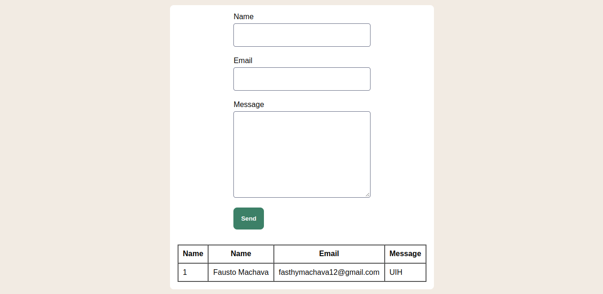

# How to use
## Database
1. Create a database with the name ux
2. Import the script **ux.sql**  that is in the project, coming from the local branch

## Project
 1. Clone the project to your computer  the local branch
 2. Copy to the project to your localhost web root folder
 3. Open file conection.php, and update the connection data passing your database host, user, password and database name
 4. Then open your browser and open http://localhost/contact

When opening the folder you wil find to find see this:

# How it works
There is a contact form with the name, email and message input, you fill this inputs and submit the data pressing the send button. The data is going to be added to the database and displayed to the table bellow the form.